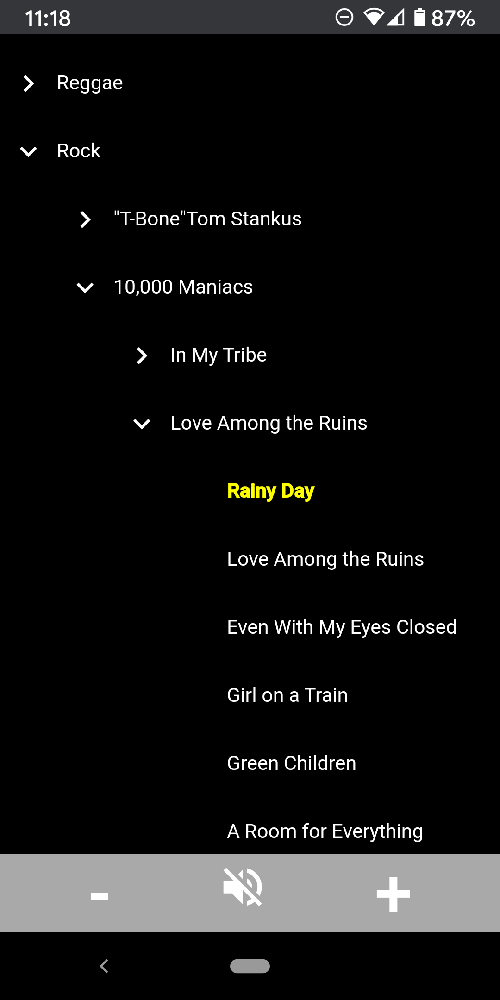

# music-browser-ui

## Web-based music player suitable for mobile use

---
Intuitive browsing, playing (start/pause/resume) and volume control.

Presents tunes in nested tree hierarchy: genre/artist/album/title.

---

Leverages [music-browser-api](https://github.com/TimBiernat/music-browser-api) backend that loads, parses and serves up tunes from host server filesystem.

Built with Angular framework using Material Design.

Deployment:

* sudo npm install -g @angular/cli
* npm install
* ng build --prod
* (setup corresponding [music-browser-api project](https://github.com/TimBiernat/music-browser-api))
* copy all files from dist/music-browser-ui to music-browser-api project public directory
* startup music-browser-api (npm start)
* point your mobile web browser to to http://{host}:{port}